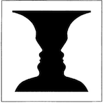

In Edwin Abbott’s 1884 satirical novel *Flatland: A Romance of Many Dimensions*, the inhabitants of a two-dimensional world struggle—and mostly fail—to conceive of dimensions beyond their own. Isaac Asimov once praised *Flatland* as “probably the best introduction one can find into the manner of perceiving dimensions,” warning us to be aware of the limitations we often unconsciously impose on our understanding of reality.Isaac Asimov, "Limitations," Introduction to *Flatland*, Barnes & Noble edition, 1983

Our current conceptual framework may be similarly limited. For centuries, the dominant cosmological model in Western thought has portrayed the universe as a vast mechanism: a grand array of discrete objects moving through space and time under fixed, mind-independent laws. Humans, according to this model, are merely observers—complex biological machines whose fleeting awareness arises from electrochemical events within the brain.

This classical conceptionsee ["classical worldview"]() in this project for a brief summary of just that. is rooted in the Aristotelian idea of an intelligible, structured universe oriented towards purpose. It was codified by Newton, whose physics proved that the universe operated by universal laws he described mathematically. And it was cemented by Darwin's naturalistic account of life’s development and its later integration with Mendellian genetics.  Together, they formed a story of the universe that remains the basic framework of modern Western civilization. 

That story has not only shaped our science, but also our philosophy, law, and even religion. In this view, often referred to as physicalism, reality is singular, objective, and composed entirely of measurable, material stuff.see ["physicalism"]()
 in this project for a brief summary of philosophical materialism or, more commonly now, physicalism. If something cannot be quantified, it is deemed illusory, irrelevant, or nonexistent. Over the last century or so, the physicalist framework has solidified its hold on Western secular thought and has morphed into the belief that science is the only valid means of describing reality.often referred to as scientism. See Dawkins, Harris, et al}

It is perhaps an understandable belief, as modern science and technology have inarguably enabled an unprecedented level of health and prosperity for most humans. But what if the scientistic framework, powerful as it has been, is as limited as the worldview of Abbott’s Flatlanders? What if mind, spirit, or some other form of intrinsic subjectivity is not an accidental byproduct of physical complexity, but a fundamental dimension of existence?

This project begins from the premise that we are poised at the threshold of a conceptual revolution—one that may ultimately prove to be more disruptive and transformative than the Copernican and Cartesian shifts that reoriented a millennia-long blending of Aristotelian and Christian cosmologies and ushered in the modern scientific age. The core of this revolution is the premise that non-material phenomena are not exclusively derivative of physical processes but instead derive in substantive part from a realm of reality largely inaccessible to scientific investigation. Mind is not a secondary phenomenon but a primary reality in its own right.
  
By simply being willing to consider the belief that reality is not exclusively physical—and that is very much a belief, not an evidence-based conclusion—another immense horizon immediately opens for exploration. It is a horizon that has been long proclaimed by esoteric philosophies and contemplative traditions, and a growing body of evidence from physics, biology, and philosophy suggests that it is indeed real. 
 
But it cannot be revealed through the methods of science. It is simply another way of looking at the world-- not instead of, but in addition to the lens of science, restricted as it is to that which can at least in principle be measured. Much like the very different images in Rubin's vase, what we see can depend on what we are looking for. 

 The first significant fractures  in the classical worldview appeared with the advent of quantum mechanics (QM) a century ago. Quantum theory, experimentally confirmed without exception across thousands of tests, reveals a cosmos very different from the orderly machine envisioned by Newton and his successors. At the quantum level, matter behaves like neither discrete particles nor continuous waves, but in strange hybrids that defy classical categorization. Entities become entangled across vast distances, influencing one another instantaneously. The act of measurement seems to play an active role in shaping what is observed.

These discoveries challenge the notion that reality is fully separable from the act of observation. They raise profound questions about the nature of consciousness and the relationship between the observer and the observed. Wolfgang Pauli, one of the founding architects of QM, understood the truly revolutionary implications it, and that QM demanded a “new idea of reality”—one that could accommodate the inextricable link between subjective awareness and the fabric of existence itself. see ["what does quantum mechanics tell us about reality?]() for a very brief introduction to the current list of notions about reality and quantum mechanics.

Yet despite its revolutionary implications, quantum theory has been treated by most scientists as just a set of useful mathematical tools, not as a foundation for rethinking reality. But the advent of QM has led to considerable debate among at least a small group of physicists and philosophers about how to interpret QM, or whether it even needs interpretation.As Niels Bohr insisted, quantum phenomena simply “are what they are,” requiring no deeper philosophical reckoning. For most practical purposes in science and technology, the classical view persists: nature is real, objective, and fully comprehensible through measurement, mathematics, and theory.  

But for a growing number of thinkers, this is no longer tenable. As David Finkelstein put it, “The deeper you go into quantum mechanics, the harder it is to hold on to any absolutes.”citation for Finklestein’s quote
 The universe revealed by quantum mechanics is profoundly relational, participatory, and indeterminate at its core.

 A central commitment of this project  is that whatever a deeper understanding of reality entails, it must remain fully natural—grounded in nature as a whole, without recourse to supernatural interventions.

However, “natural” must be reimagined. It cannot remain restricted to what is merely physical, measurable, or material in the classical sense. Consciousness, meaning, value, and experience—these too are natural phenomena, even if they elude reduction to physical substrates.

The prevailing worldview of scientism—the belief that scientific investigation is the sole path to truth about the cosmos—rests on a crucial and often unexamined assumption: that everything real is ultimately physical. But this is not a scientific discovery; it is a philosophical presumption. Science cannot adjudicate the ultimate nature of being—it can only explore patterns within experience.

Thomas Nagel, among others, has argued for an alternative framework, a *tertium quid* or “third way” beyond the false dichotomy of reductive materialism and supernatural theism. A worldview that acknowledges mind and meaning as fundamental aspects of the natural order, alongside but not reducible to physical law. 

This project explores some of the contours of such a framework: a natural spirituality that recognizes the profound interconnectedness of all that is, without abandoning scientific rigor or descending into dogmatic metaphysics. A significant implication of this broader perspective is a reframing of our assumptions about intelligence, consciousness, and the human place in the cosmos. 

Western thought has long imagined Homo sapiens as the pinnacle of evolution, as we appear to be the only species capable of complex abstraction, symbolic reasoning, and technological mastery. Intelligence, by this account, is measured by the ability to manipulate matter and generate increasingly sophisticated models of the physical world.

But this view is increasingly difficult to sustain. Odontocetes—dolphins, orcas, sperm whales, and other toothed whales—possess brains comparable in size and complexity to ours. Their social structures, cultural transmission, and communication systems suggest that Odontocetes possess forms of intelligence and culture that may be as rich as humans, even if very differently expressed. Many species of Odontocetes have existed in more or less the same form for millions of years, with brains that are about the same as they were when the first hominids began to evolve from monkeys some 20 million years ago. We simply do not know, but it does not seem unreasonable to speculate, that during during those millions of years they used their large and biologically expensive brains to achieve individual and collective communication and connectedness on levels that are as difficult for us to imagine as the concept of a sphere was to Flatlanders.
 
If the universe is indeed saturated with mind-like properties, as panpsychism and related frameworks suggest, then intelligence need not take a single archetypal form. Complex abstraction and tool-use may be one expression of higher intelligence, but they are not necessarily its apex. Emotional depth, social cohesion, symbolic richness, aesthetic experience—these too may be markers of highly evolved consciousness.
The recognition that humans are not alone among intelligent species compels a humbler, more expansive view of consciousness: not as a late, accidental bloom on an otherwise dead tree of matter, but as a pervasive and diverse phenomenon woven through the fabric of reality itself.

 In contemporary philosophy of mind,   much effort is spent attempting to define consciousness precisely—to specify its boundaries, mechanisms, and evolutionary function. These efforts, while valuable, often founder on the ambiguity and familiarity of the phenomenon itself. As one early commentator put it  “Consciousness is a fascinating but elusive phenomenon: it is impossible to specify what it is, what it does, or why it evolved. Nothing worth reading has been written about it.” The 1989 *International Dictionary of Psychology*, entry written by Stuart Sutherland.

Although a veritable industry of consciousness studies has sprung up since then, not much has changed from it all. As David Chalmers and others have observed, consciousness remains elusive not because we fail to observe it, but because it is our primary mode of existence. Much like water to a fish, consciousness is something we are fully immersed in.  It is, as Galen Strawson suggests, the only thing whose intrinsic nature we can claim to know directly.

This project proposes that it is far less important to define consciousness than to learn how to use it more fully, deliberately, and effectively. Just as electricity revolutionized human life long before its essential nature was understood (and continues to have multiple, contradictory meanings or definitions), so too consciousness holds transformative potential even in the absence of theoretical clarity.

Rather than seeking final definitions for what is likely an indefinable phenomenon, we might better turn our efforts toward developing more skillful relationships with consciousness: cultivating attention, mindfullness, meaning, coherence, and creative power. Perhaps we should explore the profound ways that subjective phenomena shape the world and how they might be directed toward deeper insight, connection, and flourishing.

 The ideas explored here   draw on multiple but what appear to be ultimately related streams of thought. Various esoteric and contemplative traditions have long envisioned a central order of the cosmos—an intrinsic harmony beyond mechanism, including Neoplatonist conceptions, theosophical frameworks dating from the 14th century, and the alchemical pursuits of Isaac Newton and others.  Monism in its various forms (some ancient) holds that everything ultimately consists of the same fundamental stuff, although there is considerable disagreement about the nature of that stuff. The dominant forms of monism in Western thought include: idealism (the idea that reality is fundamental mental or spiritual); philosophical materialism (also known as physicalism, the idea that reality is fundamentally physical); and various forms of neutral monism (that the single underlying stuff is neither mental nor physical but neutral or a mixture of both). In Hindu philosophy, Advaita Vedānta teaches that everything is Brahman (pure consciousness or existence itself). Panpsychist perspectives, also with deep historical roots, see mind-like qualities as fundamental to all things. 

More recently, the discoveries of quantum physics led to David Bohm’s framework of deep connection between an underlying order beyond space and time (the implicate order) that unfolds into the observable world (the explicate order), and the idea of a psychophysical continuum of entangled inner and outer realities developed in a decades-long collaboration between Wolfgang Pauli and Carl Jung. 

Taken alone, none of these streams offers a complete framework or worldview. But woven together, they suggest the outlines of a mind-centered cosmology: a framework in which consciousness is not an incidental phenomenon, but a core dimension of the unfolding universe. It is an unfinished and evolving picture—provisional and incomplete—and exploring it demands humility.  It is largely intuitive; our language (and thus the way we think about things) strains or is simply unable to express much about it. Just as the citizens of Flatland who didn’t outright reject the idea of a third dimension struggled to imagine it, many if not most of us are hindered by our preconceived ideas and an expectation of certainty. 

But if we resist the temptation to cling to outdated certainties and instead open ourselves to the possibility of a vastly richer natural order, we may begin to glimpse a new horizon: a world in which mind and matter are no longer alien to one another, but aspects of a single, dynamic whole. We are at the very beginning of what may one day be recognized as a new age of consciousness. If this is so, it will not replace science, logic, or empirical inquiry, but rather expand the scope of what we understand to be real.

Certainties will remain elusive, but our models can be refined, our myths can evolve, and our conceptual lenses can widen. The task, as Wolfgang Pauli and others have urged, is not to abandon reason, but to construct a broader and deeper idea of reality—one that acknowledges mind as fundamental, honors experience as meaningful, and restores a sense of belonging within the vast and mysterious unfolding of existence.

My hope is that this project makes a small contribution to that ongoing task: a search for frameworks that better fit what we know, what we sense, and what we are only beginning to imagine.
